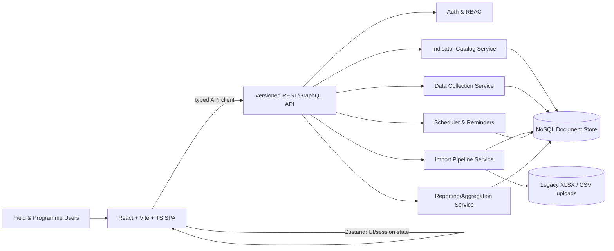

# GRiC MEL System — Functional & System Requirements Document

2026-09-18 · @Someone

## 1. Purpose, Scope & Guiding Principles

The GRiC Monitoring, Evaluation & Learning Framework (Version 3.3) currently lives as a single Excel workbook: one worksheet per programme, 241 indicators, each following an Activity → Output → Outcome → Goal results chain. This document defines the functional and system requirements for replacing that workbook with a dedicated web-based M&E system — a React/Vite/TypeScript frontend backed by a NoSQL API — that becomes the system of record for indicator definitions, periodic data collection, monitoring workflows, and reporting.

**Design principles carried over from the workbook, non-negotiable in the new system:**

1. **One row = one indicator, never bundled.** Every indicator keeps its own baseline, targets, frequency and owner as atomic, independently editable values — no combined or derived cells that hide what was actually collected.
2. **A consistent four-level results hierarchy** (Activity, Output, Outcome, Goal) applies uniformly across all seven programmes, enabling roll-up and drill-down in the same shape everywhere.
3. **Disaggregation is a first-class dimension**, not an afterthought — sex, age band, country and stakeholder type must be structured fields, not free text.
4. **Honesty over fabrication**: where a baseline or target genuinely doesn't exist yet, the system must represent "not yet tracked" as an explicit state, never a blank cell or an invented number.
5. **Cross-programme convergence** is real and intentional (e.g. Girls' Education, Out-of-School Girls and Women's Economic Empowerment share one Goal; Capacity Development and Policy & Partnership share a community well-being Goal) — the data model must support one Goal being fed by indicators from multiple programmes without double-counting reach.
6. **The system tracks its own adoption**, mirroring the workbook's own Institutional Strengthening sheet (% of indicators with an established baseline, % of reporting drawn from the system vs. still running in parallel).

**In scope for this phase:** indicator catalog management, periodic data collection and evidence capture, one-time migration of the legacy workbook plus recurring bulk imports, monitoring workflows (collection schedules, review/approval, audit trail), dashboards and reporting/export, and role-based access control.

**Out of scope for this phase (but the API must not preclude them later):** grants/financial management, HR systems, GIS mapping, and direct donor-portal integrations. The workbook already references a planned **ActivityInfo** configuration for programme data collection — this system is designed as ActivityInfo's intended replacement/superset, not a parallel tool.

## 2. System Overview & Architecture Context

The system is **API-first**: the frontend never touches the database directly and holds no persistence logic of its own — it is a pure consumer of a versioned HTTP API. This lets the backend schema (NoSQL document store, to be shared) evolve independently as long as the API contract in §9 is honoured.



**Layering:**

| Layer | Responsibility |
| --- | --- |
| Presentation (React) | Screens, forms, dashboards — no business logic beyond validation-for-UX |
| Client state (Zustand) | Session/auth, current selections, draft/offline data-entry queue, UI state |
| Server-state cache | Cached, revalidated copies of API responses (see §10 for the recommended pairing with Zustand) |
| API client | Typed request/response layer; single place that knows endpoint shapes |
| Backend API | Auth, validation, business rules, orchestration of the services below |
| Import Pipeline Service | Parses/validates legacy workbook and recurring bulk uploads (§5) |
| Scheduler Service | Computes due dates from each indicator's Frequency and fires reminders (§7) |
| Reporting/Aggregation Service | Pre-computes dashboard rollups so the frontend never aggregates raw documents client-side |
| NoSQL Document Store | System of record for indicator definitions, data points, imports, users, audit log |

**Why aggregation must happen server-side:** a NoSQL store optimised for write-heavy data-point ingestion (241 indicators × multiple periods × disaggregation slices × 3 countries) is a poor place to compute rollups on read. The Reporting/Aggregation Service is responsible for producing the pre-aggregated shapes the frontend consumes (§9, §13) — whether via denormalised summary documents updated on write, a scheduled batch job, or a query-time aggregation pipeline is a backend implementation decision, but the **API contract must always return aggregates, never raw document dumps, to dashboard endpoints**.

## 3. Core Domain Data Model

Entities derived directly from the workbook's columns and structure. This is a logical model — the eventual NoSQL schema (documents, embedding vs. referencing) is the backend team's call, but every field and relationship below must be representable and independently queryable.

| Entity | Purpose | Key fields | Relationships |
| --- | --- | --- | --- |
| **Programme** | One of the 7 top-level areas (ECCDE, Children's Learning, Girls and Women, Youth, Capacity Development, Policy and Partnership, Institutional Strengthening) | id, name, description | has many Domains |
| **Domain** | Sub-grouping within a programme (e.g. "Child-care (0–3 years)", "Cross-cutting", "PE&E / LSV") | id, name, programmeId | belongs to Programme; has many Indicators |
| **Indicator** | The atomic unit — one workbook row | id, **indicatorCode** (stable short key, minted at migration), resultStatement, indicatorText, monitoringQuestion, dataSource, frequency, responsibleRoleId, disaggregationDims\[\], sphereOfAccountability, genderIntegrationLevel, status, currentVersion | belongs to Domain; has one ResultLevel; has one Baseline; has many Targets; has many DataPoints; may link to other Indicators as convergence partners |
| **ResultLevel** | Enum: Activity \| Output \| Outcome \| Goal | value | referenced by Indicator |
| **Frequency** | Enum: Weekly \| Termly \| Quarterly \| Bi-annually \| Annually \| Per cycle \| Milestone-based (e.g. "6 and 12 months post-graduation") | value, cadenceRule | drives Scheduler |
| **SphereOfAccountability** | Enum: Direct Delivery \| Coaching / Influence \| Advocacy / Strategic Interest | value | referenced by Indicator |
| **GenderIntegrationLevel** | Enum: Unintentional \| Responsive \| Intentional \| Transformative | value | referenced by Indicator; aggregated org-wide |
| **Status** | Enum: Pending \| Ready \| Aspirational (+ future states as baselines are established) | value | referenced by Indicator |
| **Country** | Kenya, Uganda, Tanzania (expandable) | id, name, isoCode | referenced by DataPoint, UserScope |
| **DisaggregationDimension** | Sex, Age band, Country, Stakeholder type | id, name, allowedValues\[\] | attached to Indicator; sliced in DataPoint |
| **Baseline** | The indicator's starting point — often narrative, not numeric | id, indicatorId, valueType (numeric\|percentage\|narrative\|notYetTracked), numericValue?, narrativeText?, asOfDate, source | belongs to Indicator; versioned (see §5) |
| **Target** | A year's target value for an indicator | id, indicatorId, period (year or custom), valueType, numericValue?, narrativeText? | belongs to Indicator |
| **DataPoint** | An actual reported value for one indicator, one period, one disaggregation slice | id, indicatorId, period, countryId, disaggregationSlice{dim: value}, value, status (draft\|submitted\|approved\|rejected), submittedBy, approvedBy, evidenceIds\[\] | belongs to Indicator; has many EvidenceAttachments; drives audit log |
| **EvidenceAttachment** | Supporting file for a DataPoint (register scan, photo, report) | id, dataPointId, fileUrl, uploadedBy, uploadedAt | belongs to DataPoint |
| **User / Role** | System user with a functional role and scope | id, name, roleId, scopedProgrammeIds\[\], scopedCountryIds\[\] | see §11 |
| **ImportBatch** | Metadata for one import operation (legacy migration or recurring bulk upload) | id, type (frameworkMigration\|bulkData), sourceFile, importedBy, rowsAccepted, rowsRejected, status | produces DataPoints and/or Indicators; linked error report |
| **AuditLogEntry** | Immutable record of every create/update/approve action | id, entityType, entityId, actorId, action, before, after, timestamp | attached to any entity above |

**Note on baselines and targets being non-numeric:** roughly a third of workbook targets are phrases like "Growth target set with programme plan" or "Sustained on-schedule delivery" rather than numbers. `Baseline` and `Target` must support a `narrativeText` mode alongside `numericValue`/`percentage`, or the migration will fail on real data.

## 4. Functional Requirements — Data Collection

| ID | Requirement |
| --- | --- |
| FR-DC-1 | The data-entry form for an indicator is **generated dynamically from its definition**: input type (number, percentage, count, narrative) follows the indicator's `valueType`, and disaggregation fields render only where `disaggregationDims[]` is non-empty. |
| FR-DC-2 | When an indicator is disaggregated by **Sex**, the form must accept per-category values (e.g. Male / Female / Other) and auto-compute the total, flagging a mismatch if the parts don't sum to a manually entered total. |
| FR-DC-3 | Data entry supports a **draft → submitted → approved/rejected** workflow (see §7) — a Programme Officer can save incomplete work without it counting as reported data. |
| FR-DC-4 | **Bulk entry** is supported for tabular, per-site data (e.g. enrolment per centre, per CBO) via an in-app grid, not only through the import pipeline. |
| FR-DC-5 | Every DataPoint can carry one or more **evidence attachments** (photo of a register, scanned assessment, PDF report); attachments are mandatory for indicators flagged `evidenceRequired` at the catalog level. |
| FR-DC-6 | **Validation rules** run client-side (for UX) and are re-enforced server-side: required fields; percentages constrained to 0–100; numerator ≤ denominator where both exist on one indicator; no duplicate DataPoint for the same indicator + period + disaggregation slice without an explicit "revise" action. |
| FR-DC-7 | Narrative/qualitative values are first-class — an indicator whose target is "Growth target set with programme plan" must be enterable as free text, not forced into a number field. |
| FR-DC-8 | **Offline-first capture**: field officers collecting data in low-connectivity areas (several indicators explicitly reference ASAL communities) can complete entry forms offline; entries queue locally and sync on reconnect, with conflict resolution if the same DataPoint was edited elsewhere in the meantime. |
| FR-DC-9 | **Baseline revision**: because most baselines are currently "Not previously tracked" placeholders awaiting a real baseline study, the system must let an authorised user (MEL Lead) formally establish or revise a baseline, preserving the prior value in history rather than overwriting it silently. |
| FR-DC-10 | A **comment/annotation** can be attached to any DataPoint to record context (e.g. "target missed due to flooding"), visible in review and reporting views. |

## 5. Functional Requirements — Import Pipeline & Excel Migration

**5.1 One-time framework migration** (workbook → catalog)

| ID | Requirement |
| --- | --- |
| FR-IM-1 | A migration job parses each of the 7 programme worksheets and maps columns — Domain, Result Level, Result Statement, Indicator, Monitoring Question, Data Source, Frequency, Responsible, Disaggregation, Baseline, 2026/2027/2028 Targets, Sphere of Accountability, Gender Integration Level, Status — directly onto the `Indicator`/`Baseline`/`Target` entities in §3. |
| FR-IM-2 | Every migrated indicator is minted a stable **`indicatorCode`** (e.g. `ECCDE-CC03-9`) used as the key for all future imports and API references — the workbook itself has no such key today, so this is generated, not extracted. |
| FR-IM-3 | The migration is **versioned**: since the source is already "Version 3.3", the system stores the indicator catalog itself as a version history (indicators added, reworded or retired between versions), separate from the *values* reported against those indicators. |
| FR-IM-4 | A **dry-run mode** produces a row-level report (which sheet, which row, what will be created) before anything is committed, so the MEL Lead can sign off on the migration before it becomes the system of record. |

**5.2 Recurring bulk data import** (periodic values, e.g. from CBO spreadsheets or the ActivityInfo tool referenced in the framework)

| ID | Requirement |
| --- | --- |
| FR-IM-5 | Users can bulk-upload CSV/XLSX files of period data keyed by `indicatorCode`, `period`, `countryId` and disaggregation values, mapped to the DataPoint entity. |
| FR-IM-6 | A **pre-import validation pass** shows row-level errors (unknown indicator code, malformed period, out-of-range value, missing required disaggregation) before commit, with a downloadable rejected-rows report. |
| FR-IM-7 | Imports are **idempotent**: re-uploading the same file does not duplicate DataPoints; a repeated indicator+period+slice is treated as a revision request, not a silent duplicate. |
| FR-IM-8 | A downloadable **mapping template** (CSV/XLSX with the required columns and a data dictionary) is generated per programme so field teams can prepare compliant imports without guessing the schema. |
| FR-IM-9 | Every import (migration or bulk) creates an **ImportBatch** record with source file, actor, timestamp, and counts of rows accepted/rejected — visible in an import history screen and feeding the audit log. |
| FR-IM-10 | Because imports may be large, the backend processes them **asynchronously**; the frontend polls or subscribes to an import-status endpoint rather than blocking on upload (see §9).

## 6. Functional Requirements — Indicator Tracking

| ID | Requirement |
| --- | --- |
| FR-IT-1 | An **Indicator Catalog Browser** lists all 241+ indicators, filterable by programme, domain, result level, status, sphere of accountability, gender integration level and responsible role — the digital equivalent of scrolling the workbook, but queryable. |
| FR-IT-2 | Each indicator has a **detail view** showing its full definition (monitoring question, data source, frequency, disaggregation) plus its reported history (all DataPoints, target-vs-actual over time). |
| FR-IT-3 | A **results-chain view** shows an indicator in context: its Domain's Activity → Output → Outcome → Goal chain, so a user can navigate from an Activity indicator up to the Goal it ultimately feeds. |
| FR-IT-4 | **Convergence linking**: a Goal-level indicator can be explicitly tagged as shared across programmes (e.g. the shared "women and girls economically stable" goal fed by Girls' Education, Out-of-School Girls and WEE) — the system must roll these up for reporting **without double-counting** the same beneficiaries reached through more than one programme. |
| FR-IT-5 | **Target vs. Actual**: for any period and disaggregation slice, the system computes % of target achieved, and flags indicators materially off-track. |
| FR-IT-6 | **Trend view**: a time series of reported values per indicator, supporting year-over-year and cycle-over-cycle comparison (many indicators report "per cycle" or termly, not annually). |
| FR-IT-7 | **Status lifecycle**: the existing Pending / Ready / Aspirational states are modelled as a state machine (e.g. Pending → Baseline Established → Actively Tracked → Ready) with transitions logged, rather than a free-text label a user can set arbitrarily. |
| FR-IT-8 | **Indicator versioning**: edits to an indicator's definition (wording, frequency, disaggregation) are stored as a new version with an effective date; historical DataPoints remain attributed to the version of the indicator that was in force when they were collected. |

## 7. Functional Requirements — Monitoring Workflows

| ID | Requirement |
| --- | --- |
| FR-MW-1 | A **collection calendar** is derived automatically from each indicator's `Frequency` (Weekly, Termly, Quarterly, Bi-annually, Annually, Per cycle, or milestone-based like "6 and 12 months post-graduation") — due dates are computed, not manually scheduled. |
| FR-MW-2 | **Reminders** are sent to the indicator's Responsible role ahead of each due date, with **escalation to the MEL Lead or Country Coordinator** if a submission is overdue. |
| FR-MW-3 | Responsible-role assignment is **configurable per country**, since the workbook already varies ownership by country (e.g. Capacity Development Programme Officer per country, or joint MEL Lead + Programme Officer ownership at Goal level). |
| FR-MW-4 | A **review/approval queue**: submitted DataPoints enter a pending-review state; the assigned MEL Lead or Country Coordinator can approve, reject with a reason, or request revision. Only approved DataPoints are "canonical" and feed dashboards/reports. |
| FR-MW-5 | A **completeness dashboard** highlights indicators that are overdue for the current period, per programme and per country, so gaps are visible before a reporting deadline rather than discovered at it. |
| FR-MW-6 | Every state change to a DataPoint (draft → submitted → approved/rejected, and any subsequent edit) is written to the **AuditLogEntry** with actor, timestamp, before/after value — satisfying donor audit requirements. |
| FR-MW-7 | The MEL Framework's own rollout is monitored the same way: an internal dashboard tracks % of indicators with an established baseline and % of active users actually submitting through the system vs. still working offline — directly operationalising the workbook's own "MEL Framework Implementation" indicators. |

## 8. Functional Requirements — Reporting & Analytics

| ID | Requirement |
| --- | --- |
| FR-RP-1 | A **programme dashboard** shows rollups at each result level (Activity/Output/Outcome/Goal) for a selected programme, period and country, with target-vs-actual and status breakdown. |
| FR-RP-2 | A **portfolio dashboard** aggregates across all 7 programmes: indicator status mix (e.g. Pending / Ready / Aspirational counts), overdue submissions, and reach totals — with convergence-aware rollups (§6, FR-IT-4) so shared goals aren't double-counted. |
| FR-RP-3 | **Disaggregation breakdowns** (sex, age band, country, stakeholder type) render as charts on any indicator or Goal, not just totals — preserving the workbook's equity lens. |
| FR-RP-4 | A **Gender Integration Level report** computes the aggregate % of indicators rated Intentional or Transformative across the whole framework — the same calculation the workbook defines as its own institutional Goal indicator. |
| FR-RP-5 | **Country comparison views** for indicators tracked in more than one country (Kenya, Uganda, Tanzania), supporting the framework's phased-expansion pattern (several indicators show Kenya active today with Uganda/Tanzania targets for later years). |
| FR-RP-6 | **Report export** to PDF, XLSX and CSV, matching donor reporting needs and preserving the ability to hand a funder something workbook-shaped if required. |
| FR-RP-7 | **Scheduled reports** (e.g. a quarterly board pack) can be configured to generate and distribute automatically to a role or distribution list. |
| FR-RP-8 | **Drill-down navigation**: from a Goal, drill into the Outcomes and Outputs feeding it, down to the Activity level, for a given programme and period — mirroring the results-chain logic of §6. |
| FR-RP-9 | All dashboard and report data is served from **pre-aggregated backend endpoints** (§2, §9) — the frontend never computes portfolio-level sums or trends from raw DataPoint documents.

## 9. API Contract Requirements

The actual API implementation and NoSQL schema will be shared later; this section states what the frontend needs the contract to guarantee regardless of backend implementation, so frontend work can start against a mock/stub matching this shape.

| ID | Requirement |
| --- | --- |
| FR-API-1 | **Resource-oriented, versioned endpoints**: `/api/v1/programmes`, `/programmes/:id/domains`, `/indicators`, `/indicators/:id`, `/indicators/:id/datapoints`, `/datapoints`, `/imports`, `/imports/:id/status`, `/reports/dashboard`, `/users`, `/me`. |
| FR-API-2 | A **consistent JSON envelope** on every response: `{ "data": ..., "meta": { pagination/etc. }, "errors": [] }`, so the frontend's API client can handle any endpoint generically. |
| FR-API-3 | **Pagination** (cursor- or offset-based) on every list endpoint, with page size, total count (or `hasMore`) returned in `meta`. |
| FR-API-4 | **Filtering and sorting via query params** on list endpoints — at minimum `programmeId`, `domainId`, `resultLevel`, `status`, `countryId`, `periodFrom`/`periodTo`, `sort`. |
| FR-API-5 | **Auth**: bearer-token (JWT/OAuth2) on every request; a `/me` endpoint returns the current user's role and scope (programmes/countries they're permitted to act on) so the frontend can gate UI without re-deriving permissions. |
| FR-API-6 | **Standard error shape**: `{ "error": { "code": "...", "message": "...", "field": "..." } }` for both validation errors (422) and system errors, so form-level error mapping is generic. |
| FR-API-7 | **Pre-aggregated dashboard endpoints** (`/reports/dashboard`, `/reports/gender-integration`, `/reports/completeness`) return computed rollups, never raw DataPoint arrays for the frontend to sum. |
| FR-API-8 | **Async import handling**: `POST /imports` returns a job id immediately; `GET /imports/:id/status` (polled or pushed via WebSocket/SSE) reports `queued \| validating \| importing \| completed \| failed` plus a row-level error report on failure. |
| FR-API-9 | **Bulk endpoints**: multipart file upload for imports; a batch DataPoint submission endpoint for the in-app bulk-entry grid (FR-DC-4), so 50 rows of centre-level data isn't 50 separate requests. |
| FR-API-10 | **Idempotency keys** accepted on write endpoints (data submission, imports) so the offline-sync queue (FR-DC-8) can safely retry without duplicating on flaky connections. |

## 10. Frontend Architecture (React + Vite + TypeScript + Zustand)

**Stack decisions:** Vite + React 18 + TypeScript (strict mode). **Zustand** owns client/UI state; pairing it with a server-state cache library (TanStack Query or SWR) is strongly recommended so Zustand isn't asked to also handle request caching, revalidation and retries — those are exactly what §9's API contract is designed to make cache-friendly.

**Zustand store slices:**

| Store | Holds |
| --- | --- |
| `authStore` | current user, role, scope (programmes/countries), token |
| `catalogStore` | normalized Programme/Domain/Indicator entities (id-keyed), active filters for the catalog browser |
| `dataEntryStore` | in-progress draft values, the **offline sync queue** (FR-DC-8), validation state per field |
| `importStore` | current import job status, dry-run/error report |
| `dashboardStore` | selected period/country/programme filters shared across dashboard widgets |
| `uiStore` | modals, toasts, sidebar state — nothing domain-specific |

Each domain slice is normalized (`Record<id, Entity>` + ordered id lists) with typed selector hooks, mirroring the entities in §3 so the store shape and the API response shape stay close to 1:1.

**Routing (React Router):** `/login`, `/dashboard`, `/programmes/:programmeId`, `/indicators/:indicatorId`, `/data-entry/:indicatorId`, `/imports`, `/imports/:jobId`, `/reports`, `/admin/users`, `/admin/catalog`.

**Key screens:**

- **Indicator Catalog Browser** — filterable table/list (FR-IT-1), links into indicator detail
- **Indicator Detail** — definition + results-chain breadcrumb + trend chart (FR-IT-2/3/6)
- **Data Entry Form** — dynamically rendered per indicator's type/disaggregation (FR-DC-1/2)
- **Bulk Entry Grid** — spreadsheet-like multi-row entry (FR-DC-4)
- **Import Wizard** — upload → dry-run report → confirm → async status (FR-IM-4/6, FR-API-8)
- **Review Queue** — approve/reject submitted DataPoints (FR-MW-4)
- **Programme & Portfolio Dashboards** — rollups, charts, completeness (§8)
- **Report Builder / Export** — configure and export PDF/XLSX/CSV (FR-RP-6)
- **Admin: Users & Roles, Catalog Management** — role/scope assignment, indicator versioning (§11, FR-IT-8)

**Reusable components:** `IndicatorCard`, `ResultsChainBreadcrumb`, `DisaggregationInput`, `TargetVsActualChart`, `PeriodPicker`, `StatusBadge`, `EvidenceUploader`, `OfflineQueueIndicator`.

**Suggested folder structure:**

```
src/
  app/            # routing, providers, layout shell
  stores/         # Zustand slices (auth, catalog, dataEntry, import, dashboard, ui)
  api/            # typed client, one module per resource (generated once schema is shared)
  features/
    catalog/
    data-entry/
    imports/
    review/
    dashboards/
    reports/
    admin/
  components/     # shared, presentational-only components
  types/          # domain types mirroring §3 (Indicator, DataPoint, Baseline, Target, ...)
  hooks/
  utils/
```

## 11. Roles & Permissions

Roles are taken directly from the "Responsible" column across the workbook. Access control is **role-based, scoped by programme and country** (a Programme Officer for ECCDE in Kenya should not edit Youth data in Uganda).

| Role | Scope | Key permissions |
| --- | --- | --- |
| Programme Officer (per programme: ECCDE, Children's Learning, PE&E/LSV, Girls & Women, Youth Leadership, Capacity Development) | Own programme × own country | Enter/edit draft DataPoints, submit for review, view own programme dashboard |
| Policy & Partnerships Lead | Policy and Partnership programme × all countries | Same as Programme Officer, scoped to that programme |
| Knowledge Management & Communications Lead | Institutional Strengthening (KM domain) | Same as Programme Officer, scoped to that domain |
| MEL Systems Lead | Cross-programme, system configuration | Manage indicator catalog versions, configure imports, view system-health/adoption dashboard |
| Gender Focal Point | Cross-programme | Edit/confirm Gender Integration Level ratings, view the aggregate gender report (FR-RP-4) |
| Country Coordinator | All programmes × one country | Approve/reject submitted DataPoints for their country, view country dashboard |
| MEL Lead | All programmes × all countries | Approve data, manage the indicator catalog, run/approve imports, view all reports, establish/revise baselines |
| GRiC Africa Leadership | Institutional, all programmes (read + institutional-level write) | View portfolio and institutional dashboards, edit Institutional Strengthening indicators |
| System Admin | System-wide | User and role management, scope assignment, audit log access |

**Permission model:** RBAC (role defines the *action set*) combined with an attribute-based scope check (programme + country define the *object set* a role can act on) — enforced server-side on every write; the frontend uses the same scope from `/me` (FR-API-5) purely to hide/disable UI, never as the actual security boundary.

## 12. Non-Functional Requirements

| ID | Requirement |
| --- | --- |
| NFR-1 | **Performance**: dashboard views render in under 2 seconds by relying on the pre-aggregated endpoints in §9 — the frontend must never fall back to fetching raw DataPoints and summing client-side to hit this. |
| NFR-2 | **Offline resilience**: field data collection continues without connectivity (FR-DC-8); sync conflicts are surfaced to the user, never silently dropped or silently overwritten. |
| NFR-3 | **Multi-country by design**: Kenya, Uganda and Tanzania today, with several indicators already showing phased country expansion (e.g. WEE groups: "Growth including Uganda and Tanzania") — adding a country must not require a schema change. |
| NFR-4 | **Data integrity**: no destructive overwrite of a baseline, target, or approved DataPoint — every change is a new version with the prior value retained (soft-delete only, full audit trail per FR-MW-6). |
| NFR-5 | **Security & privacy**: role-based access control on every endpoint; encryption in transit and at rest; particular care given several programmes collect data involving children (ECCDE, Children's Learning, in-school and out-of-school girls) — access to child-level or centre-level identifying data is restricted beyond the general RBAC model. |
| NFR-6 | **Scalability**: the NoSQL store must sustain write-heavy ingestion across 241+ indicators × multiple periods × disaggregation slices × 3 countries without degrading dashboard read performance — hence the hard separation between write path and aggregation path in §2. |
| NFR-7 | **Auditability**: every DataPoint, baseline, target and catalog change is traceable to an actor and timestamp, sufficient for donor compliance audits. |
| NFR-8 | **Accessibility**: WCAG 2.1 AA minimum, given the system will be used by field-level officers with varying digital literacy and device quality. |
| NFR-9 | **Backup & portability**: the full indicator catalog and its data can be exported back to XLSX/CSV at any time — feature parity with the workbook it replaces, so no one is ever locked out of their own data. |

## 13. Appendix — Sample API Payloads

Illustrative only — field names and nesting will be finalised once the real schema is shared, but this is the shape the frontend is designed to consume.

**GET `/api/v1/indicators/:id`**

```json
{
  "data": {
    "id": "ind_01HZ...",
    "indicatorCode": "ECCDE-CC03-9",
    "programmeId": "prog_eccde",
    "domainId": "dom_childcare_0_3",
    "resultLevel": "Output",
    "resultStatement": "Increased number of operational childcare centres",
    "indicatorText": "Number of new childcare centres operational",
    "monitoringQuestion": "How many childcare centres are open?",
    "dataSource": "Centre registers",
    "frequency": "Quarterly",
    "responsibleRoleId": "role_eccde_officer",
    "disaggregationDims": ["Country"],
    "sphereOfAccountability": "Direct Delivery",
    "genderIntegrationLevel": "Unintentional",
    "status": "Ready",
    "baseline": { "valueType": "numeric", "numericValue": 41, "asOfDate": "2025-01-01", "note": "41 centres operational (Kenya)" },
    "targets": [
      { "period": "2026", "valueType": "numeric", "numericValue": 45 },
      { "period": "2027", "valueType": "numeric", "numericValue": 50 },
      { "period": "2028", "valueType": "numeric", "numericValue": 55 }
    ]
  },
  "meta": {},
  "errors": []
}
```

**POST `/api/v1/datapoints`** (submission)

```json
{
  "indicatorId": "ind_01HZ...",
  "period": "2026-Q1",
  "countryId": "country_ke",
  "disaggregationSlice": { "country": "KE" },
  "value": { "valueType": "numeric", "numericValue": 43 },
  "evidenceIds": ["ev_01HZ..."],
  "comment": "2 new centres opened this quarter in Kajiado",
  "idempotencyKey": "dc_2026Q1_ECCDE-CC03-9_KE"
}
```

**GET `/api/v1/reports/dashboard?programmeId=prog_eccde&period=2026-Q1`**

```json
{
  "data": {
    "programmeId": "prog_eccde",
    "period": "2026-Q1",
    "byResultLevel": {
      "Activity": { "total": 11, "onTrack": 2, "pending": 9 },
      "Output": { "total": 19, "onTrack": 6, "pending": 13 },
      "Outcome": { "total": 14, "onTrack": 0, "pending": 14 },
      "Goal": { "total": 3, "onTrack": 0, "pending": 3 }
    },
    "statusMix": { "Pending": 42, "Ready": 4, "Aspirational": 1 },
    "completeness": { "expectedThisPeriod": 15, "submitted": 11, "overdue": 4 }
  },
  "meta": { "generatedAt": "2026-04-01T00:00:00Z" },
  "errors": []
}
```
